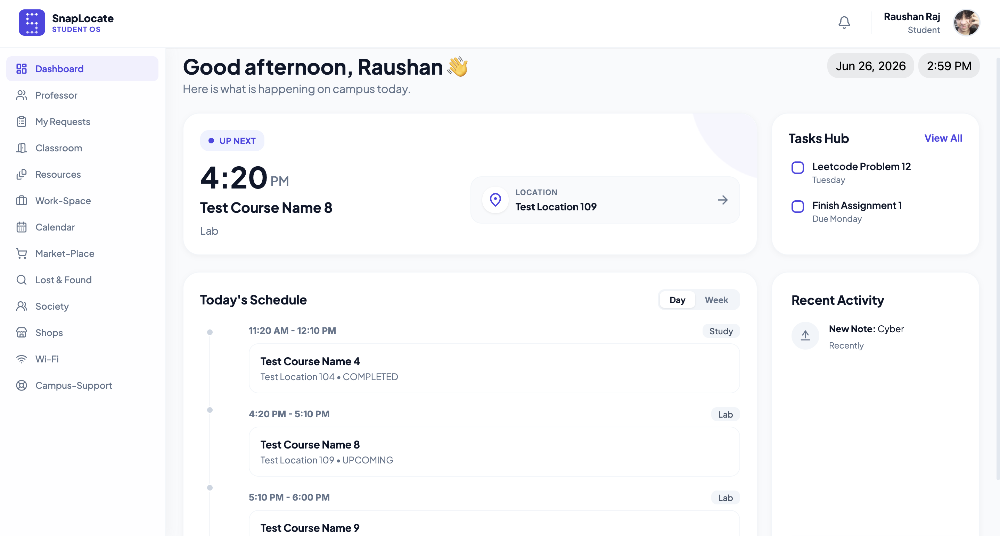

<div align="center">

# 📍 SnapLocate Campus OS

### *Just ek click, sab kuch quick!*

**Your campus compass — a unified Campus Operating System replacing disconnected tools with ONE platform, ONE login, ONE experience.**

🚀 **Live Demo:** [https://d2oddc8yzycgfi.cloudfront.net/](https://d2oddc8yzycgfi.cloudfront.net/)

[](https://react.dev/)
[](https://nodejs.org/)
[](https://supabase.com/)
[](https://tailwindcss.com/)

<br>


</div>

---

## 📖 Overview

**SnapLocate** is a fast, lightweight Campus Operating System designed for Indian universities. It aggregates everything a student, faculty, and admin needs — classrooms, academic resources, societies, marketplace, support tickets, and more — into a single unified web app. 

> **Version Note (v1.0 → v2):** SnapLocate has migrated from a legacy Firebase/HTML architecture to a modern React + Node.js + Supabase stack supporting Multi-Tenancy and a Three OS Architecture.

---

## 🏗️ Tech Stack

| Layer | Technology |
|---|---|
| **Frontend** | React v19, React Router v7, Vite v8, Tailwind CSS v4 |
| **Backend** | Node.js, Express v4 |
| **Database** | Supabase (PostgreSQL) |
| **Authentication** | JWT (7-day expiry) + OTP via AWS SES |
| **File Storage** | Cloudinary (Images/PDFs), Cloudflare R2 (Large files) |
| **Validation** | Zod (Server-side) |
| **Security** | Helmet, CORS, bcryptjs, rate limiting |

---

## 🏛️ Three OS Architecture

SnapLocate operates as **THREE distinct operating systems** sharing ONE backend:

1. **Student OS**: Student-facing pages, profile, marketplace, and workspace.
2. **Faculty OS**: Faculty-facing pages, profile, office hours, and student requests.
3. **Admin OS**: Admin-facing pages for user management, verification, and platform analytics.

Each OS has completely different UI, routing, and data access, but shares the same JWT auth and Supabase database.

---

## ✨ Features

### 🎓 Student OS
- **Dashboard**: Live greeting, schedule, pending requests.
- **Classroom Finder**: Search by room/block, live timetable per room.
- **Professor Directory**: Faculty profiles, verified badges, office hours, appointment booking.
- **Workspace**: Weekly timetable, notes (tags+colors), tasks, file uploads.
- **Campus Marketplace**: Peer-to-peer buy/sell with category filters (verified users only).
- **Lost & Found**: Post and search lost items on campus.
- **Societies & Support**: Directory for campus clubs, Wi-Fi info, and support tickets.

### 🧑‍🏫 Faculty OS
- **Faculty Profile**: Manage publications, awards, qualifications, and research interests.
- **Office Hours**: Set and manage in-person/online availability.
- **Request Management**: View and respond to student appointment requests.
- **Faculty Workspace**: Notes, tasks, and personal productivity.

### 🛡️ Admin OS
- **User Management**: View and manage student/faculty accounts.
- **Stats Dashboard**: Real-time platform analytics.
- **Verification**: Grant/revoke verified badges.
- **Campus Resources**: Manage classrooms and announcements.

---

## 🗂️ Project Structure

```text
SnapLocateV2/
├── snaplocate/                # React SPA Frontend
│   ├── src/
│   │   ├── pages/             # Student, Faculty, Admin, Auth pages
│   │   ├── components/        # Layout, Sidebar, Header, ProtectedRoute
│   │   ├── context/           # AuthContext (global auth state)
│   │   ├── hooks/             # useApi, useMutation
│   │   └── lib/               # API wrapper, Supabase client
│   └── package.json           # Frontend dependencies
│
└── server/                    # Node.js/Express Backend API
    ├── routes/                # Auth, Faculty, Students, Marketplace, etc.
    ├── middleware/            # Auth (JWT verify), Rate limiting, Multer
    ├── lib/                   # Supabase admin, Cloudinary, AWS SES, R2
    └── package.json           # Backend dependencies
```

---

## 🚀 Getting Started

### Prerequisites
- [Node.js](https://nodejs.org/) (v18+)
- Supabase Project
- Cloudinary & AWS SES Credentials (for backend)

### 1. Clone the Repository
```bash
git clone https://github.com/<your-username>/SnapLocate.git
cd SnapLocate
```

### 2. Setup Backend Server
```bash
cd server
npm install
```
- Create a `.env` file in the `server/` directory using `.env.example` as a template and fill in your Supabase, JWT, AWS SES, and Cloudinary secrets.
- Start the development server:
```bash
npm run dev
# API available at http://localhost:5000
```

### 3. Setup Frontend App
```bash
cd ../snaplocate
npm install
```
- Create a `.env` file in the `snaplocate/` directory and add your frontend environment variables (like `VITE_API_URL`).
- Start the Vite development server:
```bash
npm run dev
# App available at http://localhost:5173
```

---

## 🔒 Security & Database Rules
- **Multi-Tenancy**: Every table includes an `org_id` column. All queries are scoped to the user's organization.
- **Authentication**: JWT tokens are stored in `localStorage` and sent via the `Authorization: Bearer <token>` header. Route access is strictly guarded by role middleware (`requireStudent`, `requireFaculty`, `requireAdmin`).
- **Validation**: All POST/PUT requests are validated server-side using **Zod**.

---

## 📄 License
This project is licensed under the **ISC License**.

---

<div align="center">
Made with ❤️ for campus life · © 2026 SnapLocate
<br>
<i>"Your campus compass — find the right people, places, and paths to grow"</i>
</div>
